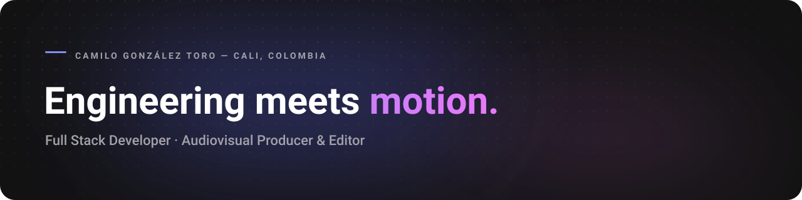

  

 

  

## About me

I'm a **Multimedia Engineer** working as a **full stack developer** and **audiovisual producer & editor**. I build web products end to end and I cut brand content, and I approach both the same way: structure first, polish second.

- Based in **Cali, Colombia**.
- Building interfaces and full-stack features with **React, TypeScript, Python, SQL and Supabase**.
- Producing and editing video with **Premiere Pro, After Effects, Photoshop and CapCut**.
- High-performance **table tennis** athlete for Selección Valle and Selección Colombia, which is where the discipline and focus under pressure come from.
- Interested in clean UI architecture, accessibility and the small details of timing and motion.

## What I bring

<table>
  <tr>
    <td width="33%" valign="top">
      <h3>Full stack development</h3>
      
Responsive interfaces and reusable components on the frontend; databases, auth and REST APIs on the backend.

    </td>
    <td width="33%" valign="top">
      <h3>Audiovisual production</h3>
      
Editing, motion and color for brand content, from short-form social to product promos.

    </td>
    <td width="33%" valign="top">
      <h3>Discipline from sport</h3>
      
Years of competitive table tennis: consistency, working under pressure and orientation to results.

    </td>
  </tr>
</table>

## Tech stack

  

  Also: Angular &#183; Flutter / Dart &#183; Premiere Pro &#183; After Effects &#183; Photoshop &#183; CapCut &#183; Blender

## Featured work

<table>
  <tr>
    <td width="50%" valign="top">
      <h3><a href="https://github.com/Camilogt22/Mi-portafolio">Portfolio</a></h3>
      
Bilingual personal site with a dev portfolio and an audiovisual reel: full-height animated hero, light/dark theme, Cloudinary-hosted videos and auto-generated live previews.

      
<code>React</code> <code>TypeScript</code> <code>Tailwind</code> <code>Vite</code>

      
<a href="https://github.com/Camilogt22/Mi-portafolio">View repository &rarr;</a>

    </td>
    <td width="50%" valign="top">
      <h3><a href="https://github.com/Camilogt22/Golden-Aura-Shop">Golden Aura Shop</a></h3>
      
Demo perfume storefront with a catalog, featured products, search and a persistent shopping cart.

      
<code>HTML</code> <code>CSS</code> <code>JavaScript</code>

      
<a href="https://github.com/Camilogt22/Golden-Aura-Shop">View repository &rarr;</a>

    </td>
  </tr>
  <tr>
    <td width="50%" valign="top">
      <h3>PingPro</h3>
      
Graduation project: a mobile app to support table tennis training. UI designed in Figma and built with Flutter, with views for organizing drills and sessions.

      
<code>Figma</code> <code>Flutter</code> <code>Dart</code>

    </td>
    <td width="50%" valign="top">
      <h3>Audiovisual work</h3>
      
Editing and short-form content for brands across food, sports and education, featured in the portfolio's reel.

      
<code>Premiere Pro</code> <code>After Effects</code> <code>CapCut</code>

    </td>
  </tr>
</table>

  

## GitHub activity

<table>
  <tr>
    <td width="33%" align="center">
      
    </td>
    <td width="33%" align="center">
      
    </td>
    <td width="33%" align="center">
      
    </td>
  </tr>
</table>

  

 

<picture>
  <source
    media="(prefers-color-scheme: dark)"
    srcset="https://raw.githubusercontent.com/Camilogt22/Camilogt22/output/github-contribution-grid-snake-dark.svg"
  />
  <source
    media="(prefers-color-scheme: light)"
    srcset="https://raw.githubusercontent.com/Camilogt22/Camilogt22/output/github-contribution-grid-snake.svg"
  />
  
</picture>

 

  Engineering meets motion — building web products and cutting stories.

